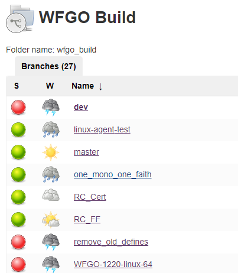
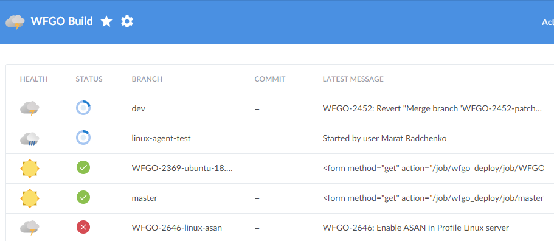

= DevOpsь меня полностью
Марат Радченко <https://github.com/slonopotamus[@slonopotamus]>
v1.0, 2020-02-26
:source-highlighter: highlightjs
:revealjs_hash: true
:revealjs_theme: league
:revealjsdir: https://cdn.jsdelivr.net/npm/reveal.js@3.9.2
:icons: font
:highlightjs-languages: groovy
:data-uri:

Ломаем билды быстро, гибко и безопасно

**{revdate}**

== !

Эта презентация автоматически компилируется из текстового файла и деплоится в эти ваши интернеты когда я делаю `git push`

=== !

У неё нет билд-менеджера, нет билд-агентов, нет десятков вики-страниц с инструкцией по установке

=== !

Есть "build.bat"

[source,ruby]
----
include::Rakefile[]
----

Это _весь_ файл

=== !

И есть "pipeline"

[source,yaml]
----
include::.github/workflows/ci.yml[]
----

И это тоже _весь_ файл

=== !

IMPORTANT: Оба файла находятся в репозитории с исходниками

=== !

Окей, игры устроены немного сложнее

== Allods Team

* A1, F1, S1, T1, D1 - тысячи их
* TeamCity/Jenkins
* Программисты делают "build.bat"
* БМы делают "pipeline"

=== И в чём проблема?

[.step]
* Pipeline внутри CI, нет доступа
* "API" между pipeline и build.bat
* Влияние веток друг на друга
* Сложный сетап агентов

=== А можно как-то иначе?

== Цели

[.step]
* Прозрачность процессов сборки/деплоя
* Изоляция веток, безопасные эксперименты
* Быстрое внесение изменений в билд-процессы
* Code review для пайплайнов

== Git - single source of truth

Все скрипты и конфиги хранятся в Git

У проекта *нет* другого места для хранения первичных данных

== Пайплайны - это просто

.Jenkinsfile
[source,groovy]
----
pipeline
{
    /* insert Declarative Pipeline here */
}
----

=== Пайплайны - это просто

.Jenkinsfile
[source,groovy]
----
pipeline {
    agent any
    stages {
        stage('build') {
            steps {
                sh 'build.sh'
            }
        }
    }
}
----

=== Multibranch pipeline

В каждой ветке свой `Jenkinsfile` => можно безопасно экспериментировать с процессом сборки

Джобы создаются и удаляются автоматически вместе с веткой

=== Что может пойти не так?

=== Всё

== Checkout

* Качать сотни гигабайт долго
* Приходится переиспользовать working copy
* `git reset -hard && git clean -fdx && git lfs pull`
* Кончается место на агентах, Jenkins не удаляет
* Залипает `.git/index.lock`

=== !

[source,groovy]
----
pipeline {
    options { skipDefaultCheckout() } # <1>
    stages {
        stage('build') {
            steps {
                ws("<project name>") { # <2>
                    checkout scm # <3>
                    sh 'build.sh'
                }
            }
        }
    }
}
----
<1> Отключаем дефолтный чекаут
<2> Вручную задаём имя воркспейса на агенте
<3> Магия, чекаутит нужный коммит

== Хранилище для артефактов: ожидание

[source,groovy]
----
pipeline {
    stage("store artifacts") {
        steps {
            archiveArtifacts artifacts: 'build/* # <1>
        }
    }
}
----
<1> На первый взгляд, вполне OK

=== icon:poop[] Не более 100 мегабайт

* Файлы хранятся на мастере Jenkins'а
* zlib-сжатие, медленно (https://issues.jenkins-ci.org/browse/JENKINS-26008[JENKINS-26008], >= 2.196)

=== Хранилище для артефактов: реальность

* t1-fatguy
* rsync/FTP icon:poop[] 2020-ый год на дворе!
* Скрипты по очистке

[.fragment]
--
NOTE: Знаете ли вы что по rsync нельзя просто так ни создать ни удалить директорию?
--

== Чат-нотификации

[source,groovy]
----
slackSend channel: "#channel-name",
          message: "☠ ${BRANCH_NAME} #${BUILD_NUMBER} failed"
----

image::images/slack-notifications.png[]

[.fragment]
--
Не умеет в приватные сообщения icon:sad-tear[]
--

== Как билдить быстро?

WGFO собирает комплект бинов/пэкеджей на 5 платформ за 1ч 15мин

* Не делать лишнего
* Выполнять в параллель независимые задачи
* Ускорять "critical path"

=== Let's go wide

[plantuml]
....
@startuml

skinparam activity {
  BackgroundColor<< Paks >> Yellow
  BackgroundColor<< Bins >> Green
  BackgroundColor<< Package >> Cyan
  BackgroundColor<< Linux >> Brown
}

(*) --> ===B1===
===B1=== --> "Cook Paks" << Paks >>
===B1=== --> "PS4 Profile Bins" << Bins >>
===B1=== --> "PS4 Release Bins" << Bins >>
===B1=== --> "XBox Profile Bins" << Bins >>
===B1=== --> "XBox Release Bins" << Bins >>
===B1=== --> "x64 Bins" << Bins >>
===B1=== --> "Switch Bins" << Bins >>
===B1=== --> "Tests"
===B1=== --> "Data Checks"
"Cook Paks" --> "PS4 Profile Package" << Package >>
"Cook Paks" --> "PS4 Release Package" << Package >>
"Cook Paks" --> "XBox Profile Package" << Package >>
"Cook Paks" --> "XBox Release Package" << Package >>
"Cook Paks" --> "Linux" << Linux >>
"PS4 Profile Bins" --> "PS4 Profile Package" << Package >>
"PS4 Release Bins" --> "PS4 Release Package" << Package >>
"XBox Profile Bins" --> "XBox Profile Package" << Package >>
"XBox Release Bins" --> "XBox Release Package" << Package >>
"PS4 Profile Package" --> ===B2===
"PS4 Release Package" --> ===B2===
"XBox Profile Package" --> ===B2===
"XBox Release Package" --> ===B2===
"Linux" --> ===B2===
"Tests" --> ===B2===
"Data Checks" --> ===B2===
"x64 Bins" --> ===B2===
"Switch Bins" --> ===B2===
===B2=== --> (*)

@enduml
....

[.fragment]
--
icon:poop[] Jenkins так не умеет
--

=== Костыли приходят на помощь

icon:crutch[] icon:crutch[] icon:crutch[] icon:crutch[] icon:crutch[]

[source,groovy]
----
def buildPackage(binary, paks) {
  waitUntil {
    finishedArtifacts.contains(binary) && // <1>
    finishedArtifacts.contains(paks) // <2>
  }

  // Билдим пэкедж
}
----
<1> Ждём когда сбилдится EXE
<2> Ждём когда сбилдятся паки с данными

[.columns.is-vcentered]
=== !

[.column]
--
Выглядит оно так себе

Но работает
--

[.column]
image::images/parallel-build.png[]

[.columns]
== Деплой в полтора клика

[.column]
image::images/jenkins-deploy.png[]

[.column]
--
HTML-форма в описании билда

Запускает джоб деплоя

Можно деплоить *любую* ветку
--

=== Кнопка деплоя

[source,groovy]
----
script {
  currentBuild.description = """
<form method="get"
    action="/job/wfgo_deploy/job/${BRANCH_NAME}/buildWithParameters">
  <input type="hidden" name="BUILD_NUM" value="${BUILD_NUMBER}" />
  <select name="SERVER4UPDATE"><option></option>"""

  Realm.values().each { Realm realm ->
    currentBuild.description += "<option>${realm.hostname}</option>"
  }

  currentBuild.description += """</select>
  <input type="submit" value="Deploy" />
</form>"""
}

----

[.fragment]
--
icon:poop[] Лимит 100 символов, без учёта тегов

https://issues.jenkins-ci.org/browse/JENKINS-31209[JENKINS-31209], >= 2.198
--

=== Ночной деплой

[source,groovy]
----
pipeline {
  triggers {
    parameterizedCron(BRANCH_NAME == "dev" ?
        "H 3 * * 1-5 % COMMIT_BINARIES=true;DEPLOY=true" :
        ""
    )
  }
}
----

== Дженкинс мог бы быть лучше

[.step]
* Нет локального запуска
* Весь функционал в плагинах, которые system-wide
* Нужны админские права даже чтобы создать джоб
* Чудовищный UI/UX

=== Blue Ocean

* Проще увидеть "какой шаг упал"
* Сложнее или никак всё остальное

== Планы и мечты

=== Воспроизводимое окружение на билд-агентах

Docker, HyperV

=== Создание тест-стендов одной кнопкой

Cloud Mail.Ru?

=== Автоматический деплой билда на клиенты

=== Динамический пул агентов

=== Более другой CI-сервис

https://drone.io/[Drone.io]? https://docs.gitlab.com/ce/ci/[GitLab CI/CD]? icon:bicycle[]?

== The End

image::images/qrcode.svg[]

link:https://github.com/slonopotamus/devops-9000[github.com/slonopotamus/devops-9000]
