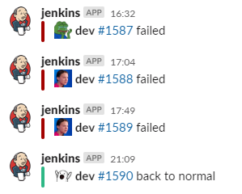

= DevOpsь меня полностью
Марат Радченко <https://github.com/slonopotamus[@slonopotamus]>
v1.0, 2020-02-26
:source-highlighter: highlightjs
:revealjs_hash: true
:revealjs_theme: league
:revealjsdir: https://cdn.jsdelivr.net/npm/reveal.js@3.9.2
:icons: font
:highlightjs-languages: groovy
:data-uri:

Ломаем билды быстро, гибко и безопасно

**{revdate}**

== !

Эта презентация автоматически компилируется из текстового файла и деплоится в эти ваши интернеты когда я делаю `git push`

=== !

У неё нет билд-менеджера, нет билд-агентов, нет десятков вики-страниц с инструкцией по установке

=== !

Есть условный `build.bat`

[source,ruby]
----
include::Rakefile[]
----

Это _весь_ файл

=== !

И условный `Jenkinsfile`

[source,yaml]
----
include::.github/workflows/ci.yml[]
----

И это тоже _весь_ файл

=== !

Оба файла находятся в репозитории с исходниками

=== Игрушечный пример!

[.step]
* Окей, это всего-лишь презентация
* Игры немного сложнее
* Да, немного

== Предыстория: Allods Team

* A1, F1, S1, T1, D1 - тысячи их
* Jenkins/TeamCity
* Отдельная команда DevOps/БМ

=== Проблемы

* Программисты отдельно от билд-менеджеров
* Билд-скрипты внутри Jenkins, нет доступа
* "Забор" между pipeline и build.bat
* Влияние веток друг на друга

[.columns]
== Предыстория: внешний мир (open source)

[.column]
--
У проекта есть

* Git-репозиторий
* Issue-tracker
--

[.column]
--
Сторонние сервисы

* Сервис CI
* Сервис для деплоя
* Хранилище релизов
* Вебсайт
--

== Цели

* Прозрачность процессов сборки/деплоя
* Возможность заглянуть внутрь и потыкать палочкой
* Изоляция веток, безопасные эксперименты
* Быстрое внесение изменений в билд-процессы
* Сборка релиза за полчаса

=== Git - single source of truth

Все скрипты и конфиги хранятся в Git

CI-сервису дан только URL до репозитория

== Пайплайны - это просто

[source,groovy]
----
pipeline
{
    /* insert Declarative Pipeline here */
}
----

=== Пайплайны - это просто

[source,groovy]
----
pipeline {
    agent any
    stages {
        stage('build') {
            steps {
                sh 'build.sh'
            }
        }
    }
}
----

=== Storage для файлов

[source,groovy]
----
pipeline {
// ...

    stage("Store artifacts") {
        always {
            archiveArtifacts artifacts: 'build/*.exe' // <1>
        }
    }
}
----
<1> Не более 100MB icon:sad-tear[]

=== Нотификации в Slack

[source,groovy]
----
slackSend channel: "#channel-name",
          message: "☠ ${BRANCH_NAME} #${BUILD_NUMBER} failed"
----

[.columns]
=== Деплой в полтора клика

[.column]

[.column]
--
HTML-форма в описании билда

Запускает джоб деплоя

Можно деплоить *любую* ветку
--

== Зависимости

[source,groovy]
----
def buildPackage(binary, paks) {
  waitUntil {
    finishedArtifacts.contains(binary) && // <1>
    finishedArtifacts.contains(paks) // <2>
  }

  // Билдим пэкедж
}
----
<1> Ждём когда сбилдится EXE
<2> Ждём когда сбилдятся паки с данными

NOTE: Одни и те же паки используются в нескольких пэкеджах

[.columns.is-vcentered]
=== !

// TODO: suppress list markers
[.column]
--
[.step]
* Выглядит оно так себе
* Зато быстро работает!
--

[.column]

== Jenkins

* Нет локальной проверки
* Весь функционал в плагинах, которые system-wide
* Нужны админские права даже чтобы создать джоб
* Чудовищный UI/UX

== Планы & мечты

* Изоляция от окружения на билд-агенте
* Билд менее чем за час
* Создание тест-стендов одной кнопкой
* Автоматический деплой билда на клиенты
* Более другой CI-сервис
* Динамический пул агентов

== Q&A

== Source

link:https://github.com/slonopotamus/devops-9000[github.com/slonopotamus/devops-9000]
